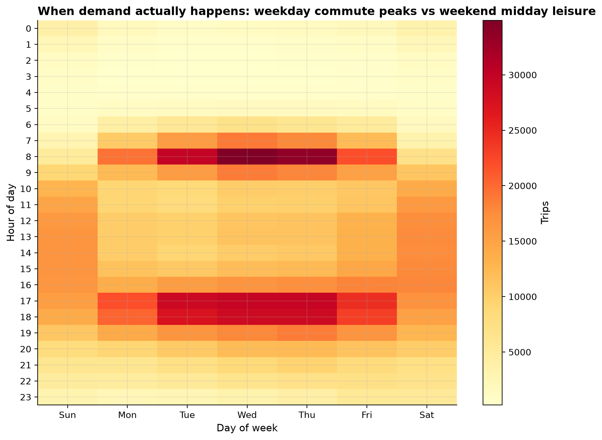
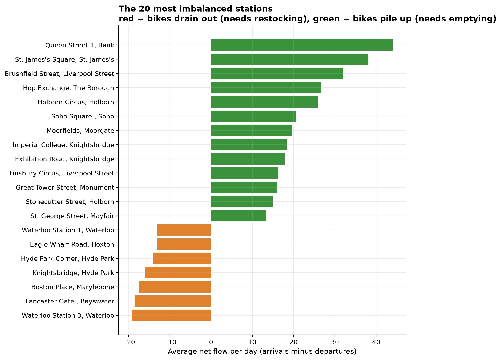

Where is Santander Cycles demand most imbalanced across London, and how should bikes be rebalanced?

Santander Cycles is London's public bike share scheme, run by TfL. A
rebalancing team has to physically move bikes between stations every day,
since riders don't naturally return bikes to where they're needed. This
project analyses 1.67 million real trips from April and May 2026, loaded
into DuckDB straight from TfL's own S3 bucket, to answer the question a
network planning team would actually ask.

1.67m

real trips analysed

803

stations

19%

of trips on e-bikes

## Findings

**Demand follows a textbook commute pattern on weekdays**, with sharp peaks
at 8am and 5 to 6pm (the evening peak is the larger of the two), and a
single broad midday hump on weekends that looks like leisure riding rather
than commuting.

**Station imbalance follows the commute, not chance.** Stations that fill
up with bikes over the day are almost all in the City of London financial
district (Bank, Liverpool Street, Moorgate, Holborn, Monument). Stations
that drain are major rail termini and park areas (both Waterloo Station
docks, Hyde Park Corner, Knightsbridge, Lancaster Gate).

**E-bikes, already 19% of trips, are used differently from classic bikes.**
They average a longer trip and are used for a round trip (same start and
end station, typical of a leisure loop) less than half as often as classic
bikes, 1.9% versus 3.2%, pointing to more genuine point-to-point commuting.

## Live dashboard

<iframe class="dashboard-embed" src="https://public.tableau.com/views/TfLCycling-DemandandRebalancingAnalysis/Dashboard1?:showVizHome=no&:embed=true"></iframe>

[Open on Tableau Public ↗](https://public.tableau.com/app/profile/michael.udousoro/viz/TfLCycling-DemandandRebalancingAnalysis/Dashboard1)

## Full write-up

- [Full report](https://github.com/Michaeludousoro/data-analytics-portfolio/blob/main/projects/01-tfl-cycling/report.md) — methodology, limitations, and recommendations
- [SQL](https://github.com/Michaeludousoro/data-analytics-portfolio/tree/main/projects/01-tfl-cycling/sql) and [notebook](https://github.com/Michaeludousoro/data-analytics-portfolio/tree/main/projects/01-tfl-cycling/notebooks) on GitHub
