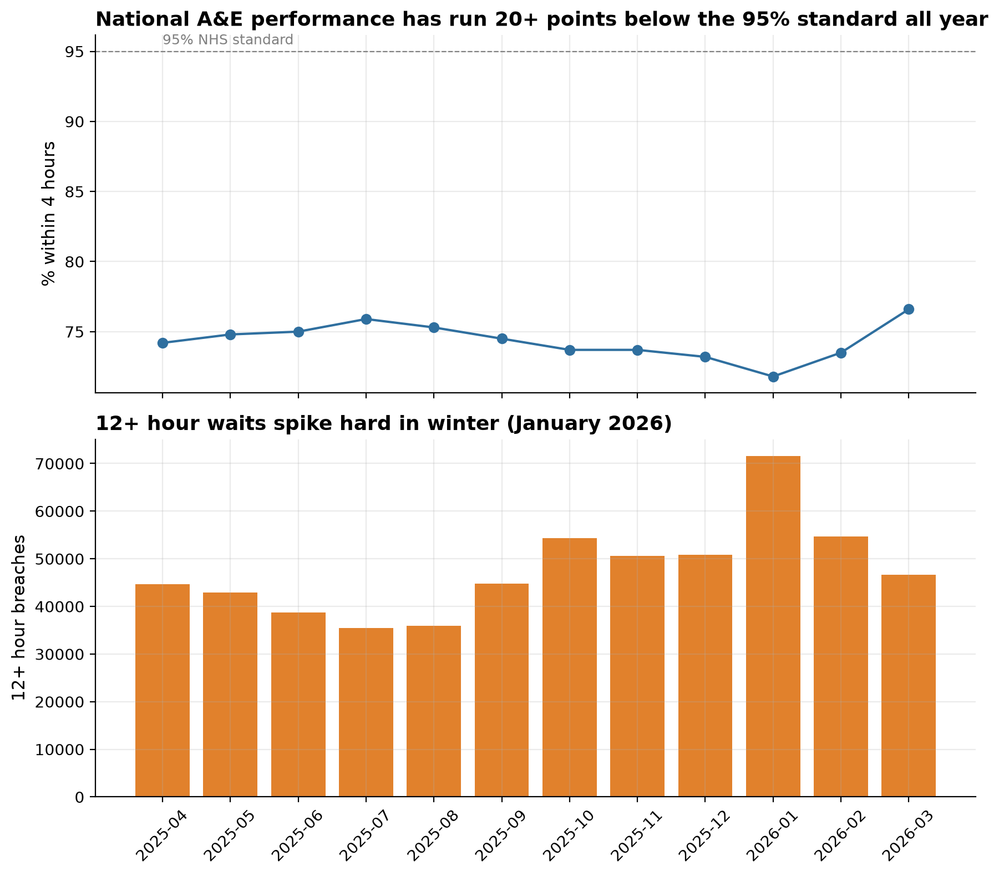
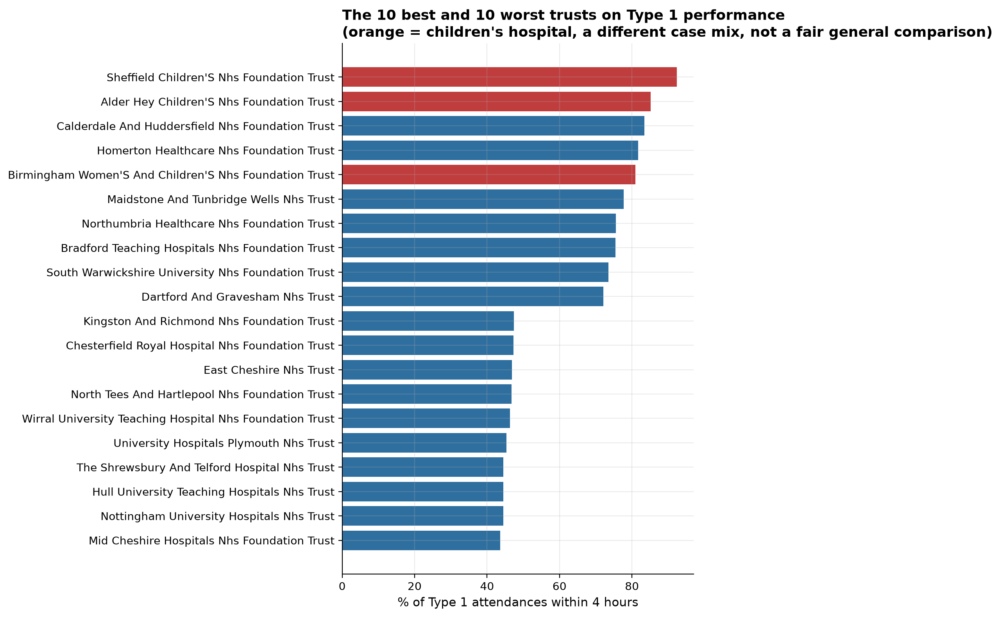

What drives A&amp;E 4-hour target breaches, and which trusts are the clearest outliers, best and worst?

NHS England publishes A&E performance data for every trust in the country
every month. This project analyses a full year of that real, current data
(April 2025 to March 2026) to answer the question a health service
performance team would actually ask.

71.8%

worst monthly 4-hour performance (Jan 2026)

205

trusts and providers

27m

attendances covered

## Findings

**National performance has sat well below the NHS's own standard all year,
and moves with the season.** 4-hour performance ranged from 71.8% to 76.6%
across the 12 months, far short of the 95% standard every single month.
January 2026 was the low point: 71.8% performance and 71,517 attendances
waiting 12 or more hours.

**The best-performing trusts by Type 1 percentage are children's
hospitals, a case-mix confound, not a best-practice story.** Excluding
Sheffield Children's (92.4%) and Alder Hey Children's (85.2%), Calderdale
and Huddersfield leads general trusts at 83.4%. The worst general trusts
sit in the low-to-mid 50s percent.

**The most severe measure, 12+ hour waits, varies about three times over
by region**, and trust size barely explains performance at all (a
correlation of just 0.07 between average monthly Type 1 volume and 4-hour
performance across 124 trusts).

## Live dashboard

<iframe class="dashboard-embed" src="https://public.tableau.com/views/NHSAEPerformance-NationalTrendandTrustBenchmarking/NHSAEPerformance?:showVizHome=no&:embed=true"></iframe>

[Open on Tableau Public ↗](https://public.tableau.com/app/profile/michael.udousoro/viz/NHSAEPerformance-NationalTrendandTrustBenchmarking/NHSAEPerformance)

## A note on tooling

This project was originally planned as a Power BI dashboard. Power BI
Desktop has no native Mac build, and Power BI's web service needs a work or
school Microsoft account rather than a personal one, so it was built in
Tableau instead. Full reasoning in the [project README](https://github.com/Michaeludousoro/data-analytics-portfolio/tree/main/projects/02-nhs-ae).

## Full write-up

- [Full report](https://github.com/Michaeludousoro/data-analytics-portfolio/blob/main/projects/02-nhs-ae/report.md) — methodology, limitations, and recommendations
- [SQL](https://github.com/Michaeludousoro/data-analytics-portfolio/tree/main/projects/02-nhs-ae/sql) and [notebook](https://github.com/Michaeludousoro/data-analytics-portfolio/tree/main/projects/02-nhs-ae/notebooks) on GitHub
