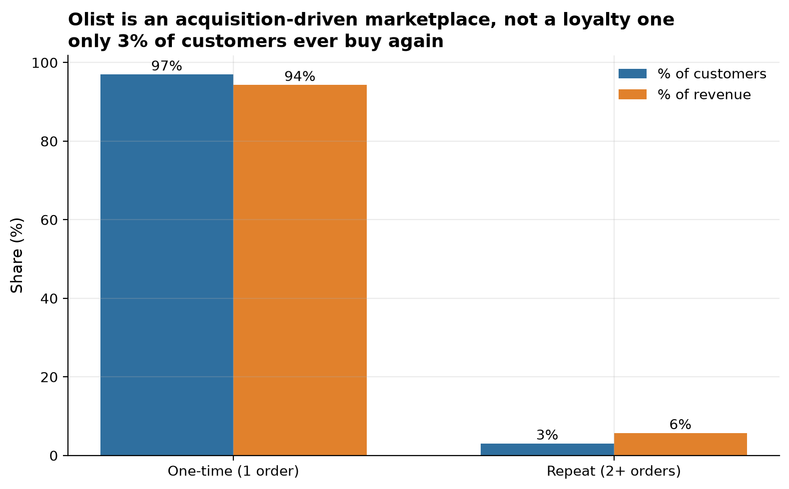
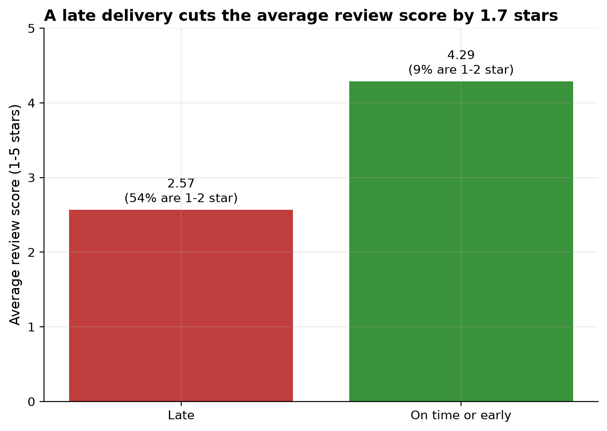
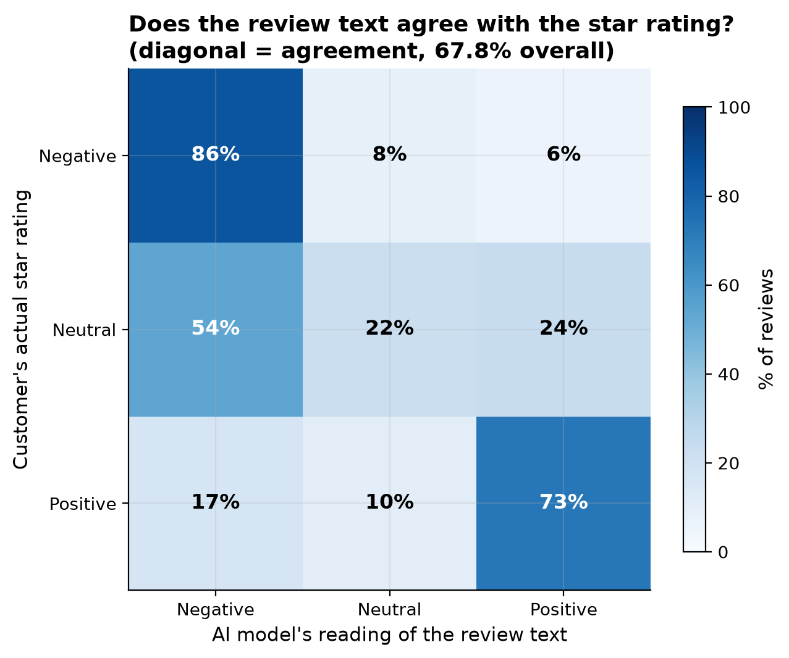

Who are the valuable customers, does a late delivery cost you a good review, and what does an AI sentiment layer on the review text add?

Olist is a Brazilian marketplace connecting small sellers to major online
storefronts. This project analyses about 99,000 real orders placed between
September 2016 and October 2018, answering questions a Retention Lead, an
Operations Manager, and a Category Manager would each genuinely ask.

3.0%

of customers ever buy twice

4.29 → 2.57★

on-time vs late delivery review score

67.8%

AI sentiment agrees with star rating

## Findings

**Repeat customers are rare but valuable, and revenue still depends on
one-time buyers.** Only 3.0% of customers ever place a second order.
Repeat customers are worth almost twice as much individually (308 BRL
average lifetime value versus 161 BRL for one-time buyers), but 94% of all
revenue still comes from people who never come back.

**A late delivery is the single biggest driver of a bad review.** Orders
delivered after the promised date average 2.57 stars, with 54% landing at
1 or 2 stars. On-time or early orders average 4.29 stars, with only 9%
that low.

**The AI sentiment layer on 2,500 real Portuguese-language reviews finds a
real gap between text and star rating.** Direction agreement is 67.8%, and
16.9% of 4 and 5 star reviews contain text the model reads as negative, a
hidden-complaint signal the star rating alone misses.

## Live dashboard

<iframe class="dashboard-embed" src="https://public.tableau.com/views/OlistRetail-RevenueandDeliveryAnalysis/OlistRetailAnalysis?:showVizHome=no&:embed=true"></iframe>

[Open on Tableau Public ↗](https://public.tableau.com/app/profile/michael.udousoro/viz/OlistRetail-RevenueandDeliveryAnalysis/OlistRetailAnalysis)

## Full write-up

- [Full report](https://github.com/Michaeludousoro/data-analytics-portfolio/blob/main/projects/03-retail-olist/report.md) — methodology, limitations, and recommendations
- [SQL](https://github.com/Michaeludousoro/data-analytics-portfolio/tree/main/projects/03-retail-olist/sql) and [notebook](https://github.com/Michaeludousoro/data-analytics-portfolio/tree/main/projects/03-retail-olist/notebooks) on GitHub
