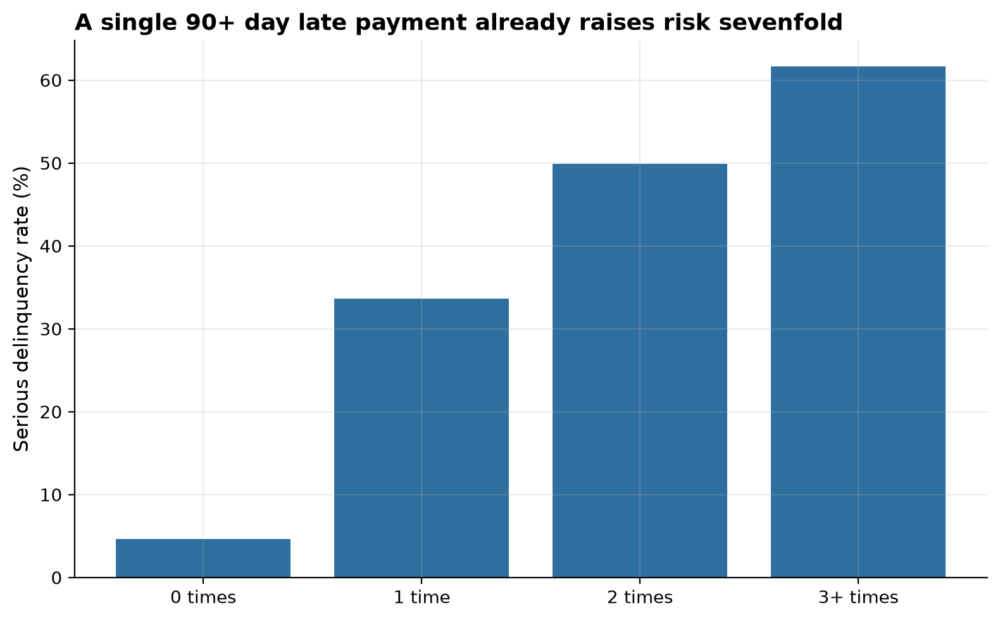
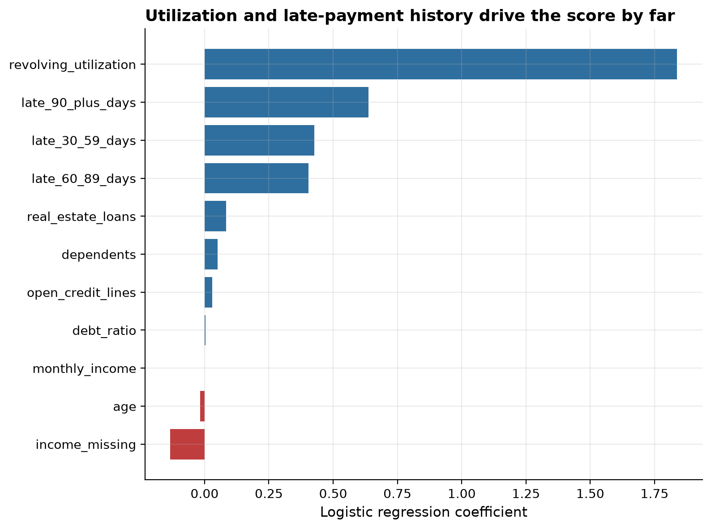
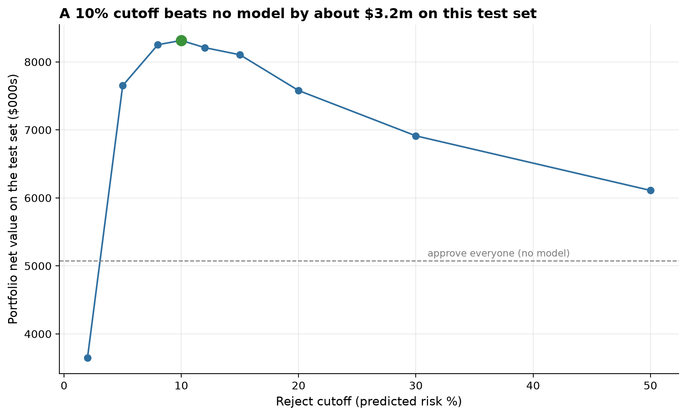

Can a lender cut default losses without rejecting too many good borrowers?

A lender wants to approve borrowers who will repay and decline borrowers
who will seriously default, using only information available at
application time. This project builds a simple, explainable risk score
from a borrower's credit history, using the Give Me Some Credit dataset of
150,000 borrowers, then answers where the approval cutoff should actually
sit as a dollar question, not a statistics question.

0.85

model AUC on held-out data

63.9%

of defaults caught at the 10% cutoff

$3.2m

portfolio value gained vs approving everyone

## Findings

**Late payment history is the strongest signal in the data.** Borrowers
with no 90+ day late payment default 4.63% of the time. A single such late
payment already raises that to 33.66%, roughly seven times higher.

**A logistic regression scores borrowers well while staying explainable.**
Trained on 11 features, the model reaches an AUC of 0.85 on held-out data,
meaning it correctly ranks a random defaulter as riskier than a random
non-defaulter 85% of the time.

**The right cutoff is a dollar question, not a statistics question.**
Under illustrative cost assumptions, rejecting anyone scored at 10% risk
or higher catches 63.9% of defaults while only turning away 12.4% of good
borrowers, lifting portfolio value by about $3.2 million on a
45,000-borrower test set. A more aggressive 2% cutoff catches nearly every
default but destroys more value than it saves by rejecting 69.4% of good
borrowers.

An accompanying [Excel scenario model](https://github.com/Michaeludousoro/data-analytics-portfolio/blob/main/projects/04-finance-credit-risk/outputs/dashboards/cutoff_scenario_model.xlsx)
makes the two cost assumptions live, editable cells.

## Live dashboard

<iframe class="dashboard-embed" src="https://public.tableau.com/views/CreditRisk-CutoffAnalysis/CreditRiskCutoffAnalysis?:showVizHome=no&:embed=true"></iframe>

[Open on Tableau Public ↗](https://public.tableau.com/app/profile/michael.udousoro/viz/CreditRisk-CutoffAnalysis/CreditRiskCutoffAnalysis)

## A note on the data and tooling

This project was originally planned around Kaggle's American Express
Default Prediction dataset, which proved infeasible without Kaggle
credentials (16-50GB, competition-gated). It was swapped for Give Me Some
Credit, a smaller dataset with interpretable features, arguably better for
a portfolio piece. It was also originally planned as a Power BI dashboard;
built in Tableau instead after a Windows VM attempt to run Power BI proved
impractical to drive. Full reasoning in the [project README](https://github.com/Michaeludousoro/data-analytics-portfolio/tree/main/projects/04-finance-credit-risk).

## Full write-up

- [Full report](https://github.com/Michaeludousoro/data-analytics-portfolio/blob/main/projects/04-finance-credit-risk/report.md) — methodology, limitations, and recommendations
- [SQL](https://github.com/Michaeludousoro/data-analytics-portfolio/tree/main/projects/04-finance-credit-risk/sql) and [notebook](https://github.com/Michaeludousoro/data-analytics-portfolio/tree/main/projects/04-finance-credit-risk/notebooks) on GitHub
