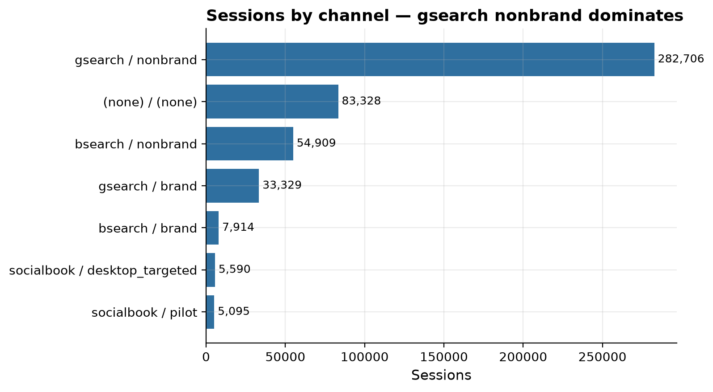
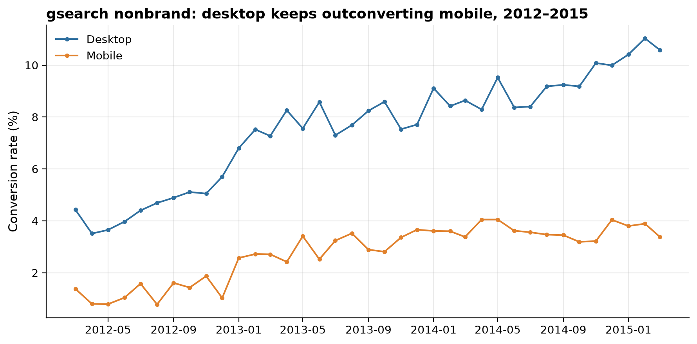
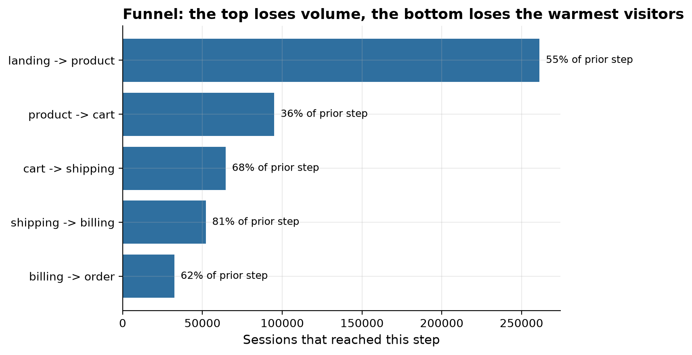

Which channels convert, where does the funnel leak, and did the website A/B tests actually work?

Maven Fuzzy Factory is a simulated e-commerce startup selling plush toys
online, launched in March 2012. Acting as its first data analyst, this
project answers a year and a half of leadership's real questions about
marketing channels, bid optimisation, conversion funnel drop-off, website
A/B tests, and seasonality, entirely in SQL.

72%

of sessions from search channels

2.6x

desktop vs mobile conversion

+41%

relative lift from the billing redesign

## Findings

**Channel choice barely matters for new-customer conversion once repeat
visitors are controlled for.** gsearch and bsearch together account for
about 72% of sessions, but restricted to first-time sessions, most
channels converge to about 6.7-6.9% conversion.

**Desktop converts far better than mobile, and billing is where visitors
drop off.** Desktop converts about 2.6x better than mobile on gsearch
nonbrand (8.22% vs 3.18%, new visitors). Billing-to-order conversion is
only 62.1%, meaning 38% of visitors who already entered shipping details
abandon at payment.

**The billing-page redesign is a confirmed win.** The new /billing-2 page
converts at 63.4% versus the original /billing's 44.8%, an 18.6 point
gain, about a 41% relative lift. Separately, /lander-3 was confirmed as a
losing landing-page variant, converting at less than half the rate of
/lander-2.

## Live dashboard

<iframe class="dashboard-embed" src="https://public.tableau.com/views/MavenFuzzyFactory-MarketingFunnelAnalysis/MarketingFunnelOverview?:showVizHome=no&:embed=true"></iframe>

[Open on Tableau Public ↗](https://public.tableau.com/app/profile/michael.udousoro/viz/MavenFuzzyFactory-MarketingFunnelAnalysis/MarketingFunnelOverview)

## Full write-up

- [Full report](https://github.com/Michaeludousoro/data-analytics-portfolio/blob/main/projects/05-marketing-funnel/report.md) — methodology, limitations, and recommendations
- [SQL](https://github.com/Michaeludousoro/data-analytics-portfolio/tree/main/projects/05-marketing-funnel/sql) and [notebook](https://github.com/Michaeludousoro/data-analytics-portfolio/tree/main/projects/05-marketing-funnel/notebooks) on GitHub
