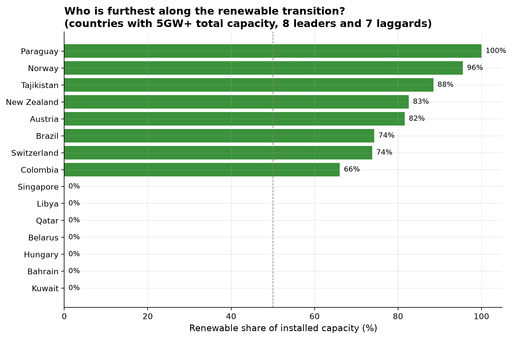
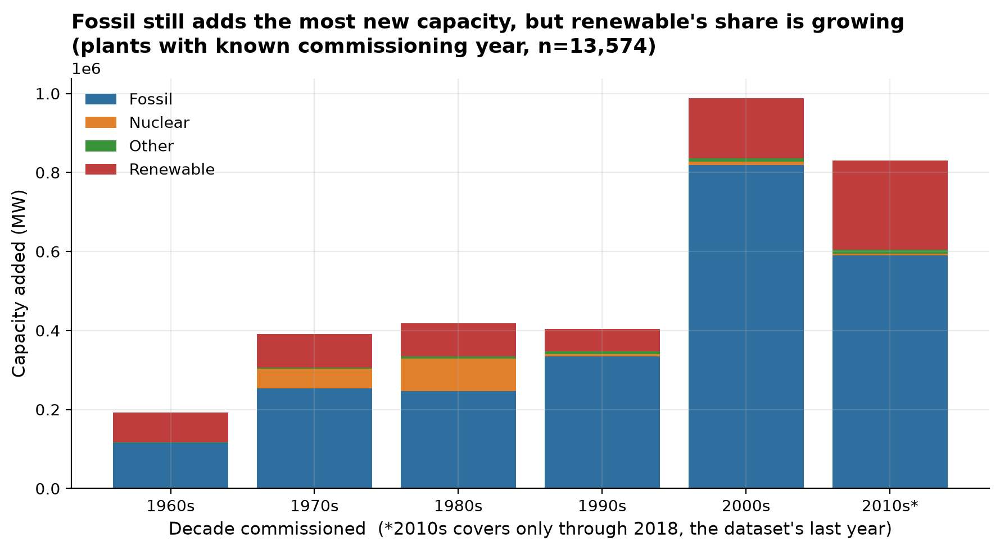

How far along is the world's shift away from fossil fuel electricity generation, and how reliable is the data behind that question?

Governments, utilities, and investors need to know how fast the world is
shifting away from fossil fuel electricity generation, and where. This
project analyses the World Resources Institute's Global Power Plant
Database, about 28,700 power plants in 164 countries covering roughly 80%
of the world's generation capacity, to answer that directly from the data.
It began as a past university assignment, redone here independently to a
professional standard rather than resubmitted.

62%

of plants are renewable, by count

25%

of plants are renewable, by capacity

15% → 28%

renewable's share of new capacity, 2000s to 2010s

## Findings

**Renewables dominate by plant count, but not by capacity.** By count,
renewables already make up 62% of the world's power plants. By capacity
they're only 25%, since fossil fuel plants are on average far bigger.

**The renewable transition is deeply uneven across countries.** The
most renewable-heavy grids are hydro-rich countries (Paraguay 100%,
Norway 96%, Tajikistan 88%). The least renewable are Gulf oil and gas
states at or near 0%.

<iframe class="dashboard-embed" src="06-world-map.html"></iframe>

**Fossil fuel still adds more new capacity than renewables every decade,
but the gap is closing.** Renewable's share of new capacity rose from 15%
in the 2000s to 28% in the 2010s (a partial decade in this data).
Renewable plants are also the least documented: solar, biomass, and wind
plants are missing a commissioning year for 60-64% of plants, versus
25-28% for coal and oil, which undercuts confidence in exactly how fast
that transition is really moving.

## Full write-up

- [Full report](https://github.com/Michaeludousoro/data-analytics-portfolio/blob/main/projects/06-energy-power-plants/report.md) — methodology, limitations, and references
- [Notebook](https://github.com/Michaeludousoro/data-analytics-portfolio/tree/main/projects/06-energy-power-plants/notebooks) on GitHub

A live Tableau or Power BI dashboard for this project is still to come.
